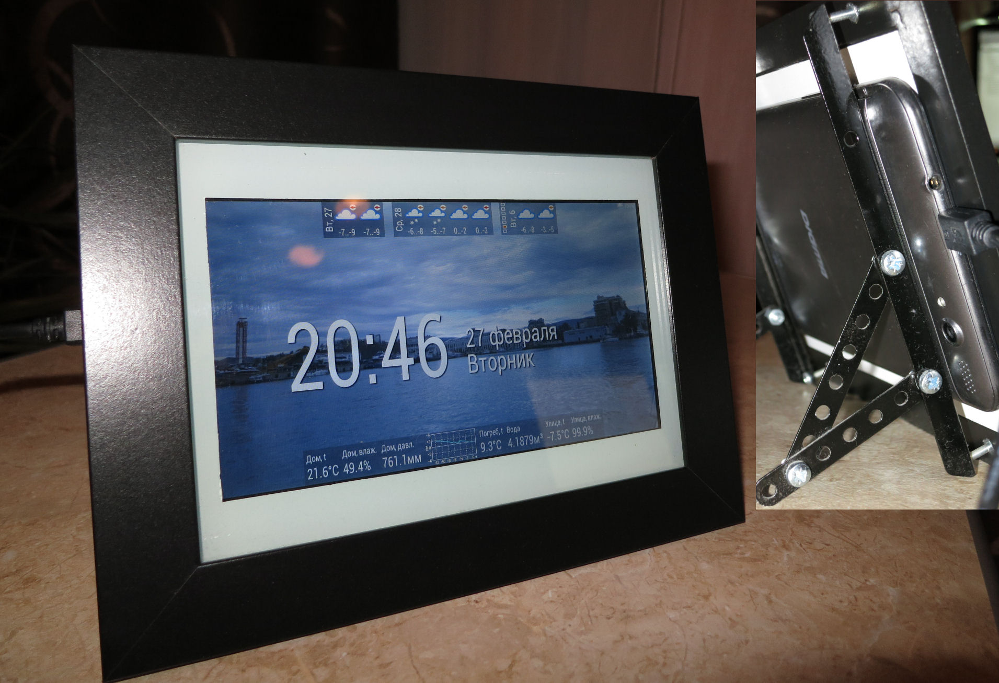

Обзор 
=====

Основная цель проекта - предоставить "вторую жизнь" старым планшетам на ОС Android, превращая их в фоторамку. Планшет может быть с нерабочим или разбитым touch-screen'ом - после некоторой предварительной настройки конфигурирование и загрузка фотографий осуществляется по http (через браузер на настольном компьютере). Приложение запускается автоматически при включении планшета, и в то же время не заменяет стандартный launcher.

Кроме показа фотографий фоторамка может отображать различные из встроенных "виджетов":
1. Прогноз погоды сроком до 10 дней (2 источника прогноза)
2. Часы + текущая дата
3. Произвольные значения от метеостанций, системы "умного" дома или любого источника в домашней сети или сети Интернет, данные от которого можно получить HTTP GET или POST запросом и обработать относительно простыми языковыми средствами. 
4. График изменения давления от домашнего датчика давления (актуально для краткосрочного прогноза погоды)

Ядром конфигурации является Lua-скрипт, который определяет:
1. Состав виджетов. Без них планшет будет всего лишь простой фоторамкой
2. Задачи по получению данных и обновлению виджетов
3. Уведомления по СМС (например, на основании значения какого-либо датчика). Телеграм в планах
4. Обработку входящих СМС

Скрипт может и управлять сторонними системами: например, при получении СМС с определенного номера выдать управляющий HTTP-запрос, по которому будет переключено реле, отосланы команды с эмулятора инфракрасного пульта и т.п. Фоторамка легко интегрируется с проектом [wifi-iot.com](https://wifi-iot.com) на базе [ESP8266](https://ru.wikipedia.org/wiki/ESP8266)/ESP32 или подобными.
Если у вас нет желания или навыков общения с языком программирования [Lua](https://ru.wikipedia.org/wiki/Lua), то можно оставить скрипт конфигурации пустым или взять одно из приведенных ниже готовых решений.

Подготовка планшета
===================

Основные требования к планшету: он должен включатья и загружаться, иметь Android 4 или более новый, Wi-Fi.

Если стекло touch-screen'а разбито - необходимо удалить осколки, не повредив сам экран планшета. Как правило, стекло приклеено подобно скотчу. Подробные видео можно найти на YouTube по теме "замена touch-screen планшета". При отсутствующем или неработающем touch-screen понадобится [OTG](https://ru.wikipedia.org/wiki/USB#USB_OTG)-переходник и USB-клавиатура или мышь, чтобы выполнить (единожны) первоначальные настройки планшета.

Для планшета необходимо установить режим выключения экрана при бездействии (он же "спящий режим") - "никогда". В разделе "безопасность" включить "неизвестные источники" ("разрешить установку приложений из неизвестных истоников"). Настроить Wi-Fi, чтобы планшет был в домашней сети.

На данный момент приложения нет в GooglePlay, поэтому для установки необходимо скачать самый свежий apk-файл из каталога *bin* и [установить его на планшет с помощью *adb*](https://www.google.com/search?q=установка+apk+через+adb).

Варианты оформления планшета могут быть различными. Ниже показан вариант настольной фоторамки из 7-дюймового планшета, рамки из IKEA для фото 15*20см и упоров из деталей детского конструктора. Можно повесить на стену. 


Предполагается, что зарядное устройство подключено к планшету постоянно. Возможно, это и сказывается негативно на батарее, но в таком режиме планшет служит мне уже около 3х лет, при том, что достался изрядно попользованным, и при отключении электроэнергии от батареи "тянет" до 3х часов. 

Конфигурирование
================

После первого запуска приложения из-за отсутствия фотографий планшет покажет адрес, который нужно открыть в браузере. Обратите внимание, что порт 8000, а не 80. Встроенный в фоторамку web-сервер позволяет загружать фотографии, создать скрипт на ЯП Lua и смотреть лог его выполнения. 

Фотографии при сохранении на фоторамке перепаковываются под разрешение планшета (в сторону уменьшения), поэтому решите, стоит ли рассчитывать на фоторамку как на единственное место хранения домашнего фотоархива.

Lua-скрипт должен создать и вернуть таблицу, содержащую таблицу `widgets` с виджетами, и `tasks` - с заданиями. Виджеты создаются с помощью метода объекта `widgetsFactory:create(type, params...)`. `Type` - строка, определяющая тип виджета: *clock* для часов, *inline* - для виджета типа заголовок-значение. Более подробно о типах виджетов и их параметрах см. в wiki проекта.

Пример простейшего скрипта с часами, процентами заряда батареи и прогнозом погоды от службы pogoda.com:
```lua
config = {}
config.widgets = {}

config.widgets.battery = widgetsFactory:create('battery')
config.widgets.clock = widgetsFactory:create('clock')

config.widgets.weather = widgetsFactory:create('pogoda.com', '246906', 'ayh4n642tshj')
  
retrun config

```
Вместо `246906` укажите свой город. Для этого придется зарегистрироваться на сайте [pogoda.com](https://www.pogoda.com/api/#/login), или же пишите мне, постораюсь ответить как можно быстрее. Также, посмотрите, есть ли ваш город на сайте [terrameteo.ru](http://terrameteo.ru), получите ссылку для **мобильной** версии сайта и создайте виджет прогноза погоды следующим образом:
```lua
config.widgets.weather = widgetsFactory:create('terrameteo', 
  'http://m.rostovmeteo.ru/town.php?name=novocherkassk')
```  

Другой пример скрипта: получать данные с метеостанции каждую минуту (пример ответа `hostname:ESP00A0E2D2;dhtt1:21.4;dhth1:44.9;bmpt:21.2;bmpp:762.50;`), отображать их, и при понижении температуры с датчика `dhtt1` ниже 0 отправить смс:
```lua
require('ru.revivedtablet.config.SmsLib')
require('ru.revivedtablet.config.HttpLib')

config = {}
config.widgets = {}
config.tasks = {}

config.widgets.battery = widgetsFactory:create('battery')
config.widgets.clock = widgetsFactory:create('clock')

config.widgets.home_t = widgetsFactory:create('inline', 'Дом, t')
config.widgets.home_hmd = widgetsFactory:create('inline', 'Дом, влаж.')
config.widgets.home_prs = widgetsFactory:create('inline', 'Дом, давл.')
config.widgets.home_prs_g = widgetsFactory:create('pressure-inline', 'Дом, гр-давл')

config.tasks[60] = function() 
  local res = http.get('http://192.168.1.36/sensors')
  if res then
    for k, v in string.gmatch(res, "(%w+):([%d\.]+);") do
      if k == 'dhtt1' then
        config.widgets.home_t:setValue(v .. '°C')
        if tonumber(v) < 0 then
            sms.send('+79001234567', 'Замерзаем!', 12)
        end 
      elseif k == 'dhth1' then
        config.widgets.home_hmd:setValue(v .. '%')
      elseif k == 'bmpp' then
        config.widgets.home_prs:setValue(v:sub(1,5) .. 'мм')
        config.widgets.home_prs_g:setValue(v)
      end
    end
  else 
    config.widgets.home_t:setValue('??')
    config.widgets.home_hmd:setValue('??')
    config.widgets.home_prs:setValue('??')
  end
end
  
return config
```

Более подробно о заданиях, доступных библиотеках (сейчас их 2 для СМС и Http) см. в wiki проекта.
